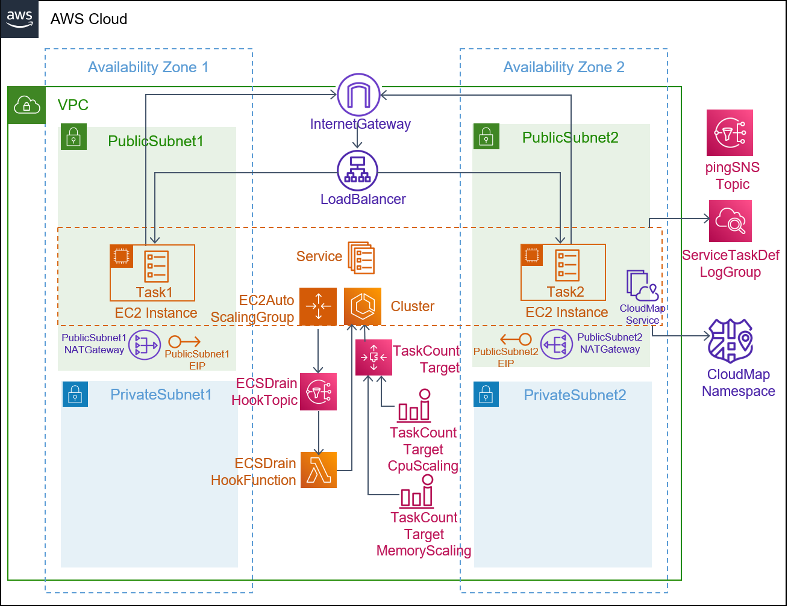
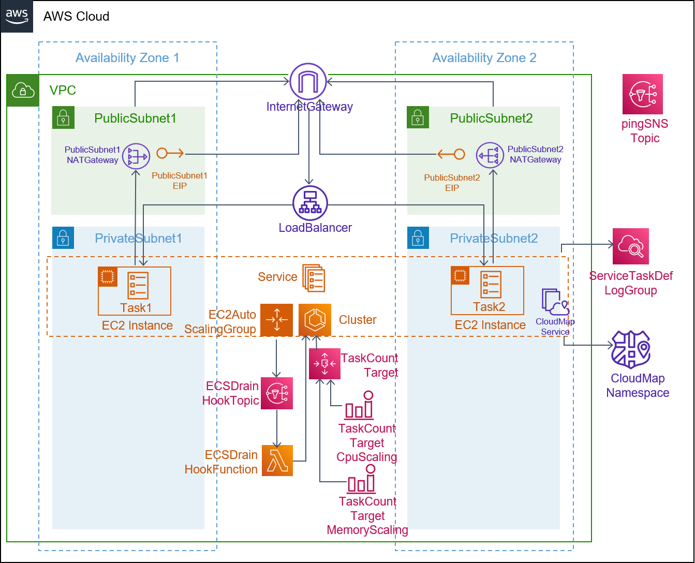

## Description

This template is compatible with the [ecs-ec2-env](../../environment-templates/ecs-ec2-env) template. It creates an ECS service running on a Self-managed cluster of EC2 hosts fronted by a public facing load balancer. The loadbalancer_type parameter allows you to choose between an application load balancer and a network loadbalancer. The service is configured to use the Bridge networking utilizing Docker's built-in virutal network that runs inside each container. The bridge network mode creates a layer between the host and the networking of the container. Please see [Amazon ECS task networking](https://docs.aws.amazon.com/AmazonECS/latest/developerguide/task-networking.html) for more information. Other service properties like port number, desired task count, task size (cpu/memory units), and docker image URL can be specified through the service input parameters. 

The template also provisions a CodePipeline based pipeline to pull your application source code before building and deploying it to the Proton service. To use sample application code, please fork the sample code repository [aws-proton-sample-services](https://github.com/aws-samples/aws-proton-sample-services). By default, the template deploys a static website to the service. 

## Architecture

### Public Subnet

### Private Subnet

## Parameters

### Service Inputs

1. port: The port to route traffic to
2. desired_count: The default number of ECS tasks you want running
3. task_size: The size of the task you want to run
4. loadbalancer_type: Type of loadbalancer to front your service
5. image: The name/url of the container image
6. backendurl: Service discovery url of the backend service

### Pipeline Inputs

1. service_dir: Source directory for the service
2. dockerfile: The location of the Dockerfile to build
3. unit_test_command: The command to run to unit test the application code
4. environment_account_ids: The environment account ids for service instances using cross account environment

## Security

See [CONTRIBUTING](../../CONTRIBUTING.md#security-issue-notifications) for more information.

## License

This library is licensed under the MIT-0 License. See the [LICENSE](../../LICENSE) file.

