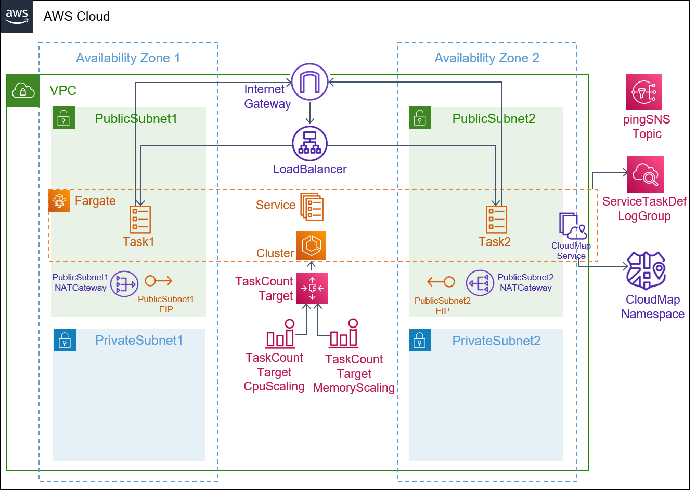
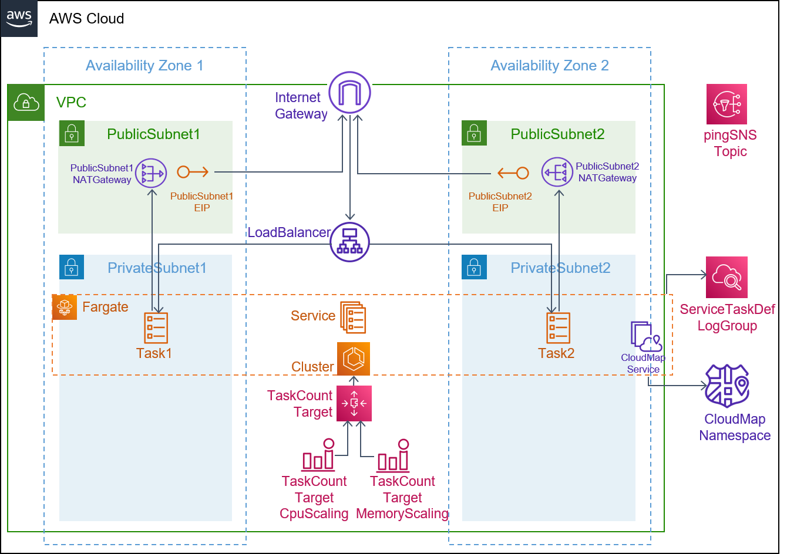

## Description

This template is compatible with the [fargate-env](../../environment-templates/fargate-env) template. It creates an ECS service running on a Fargate cluster fronted by a public facing load balancer. The loadbalancer_type parameter allows you to choose between an application load balancer and a network loadbalancer. The service can be configured to run in a Public subnet with direct internet access or in a Private subnet without direct internet access. The networking configuration of can be selected using the subnet_type parameter. Other service properties like port number, desired task count, task size (cpu/memory units), and docker image URL can be specified through the service input parameters.

The template also provisions a CodePipeline based pipeline to pull your application source code before building and deploying it to the Proton service. To use sample application code, please fork the sample code repository [aws-proton-sample-services](https://github.com/aws-samples/aws-proton-sample-services). By default, the template deploys a [static website](https://github.com/aws-samples/aws-proton-sample-services/tree/main/ecs-static-website) to the service.

## Architecture

### Public Subnet

### Private Subnet

## Parameters

### Service Inputs

1. port: The port to route traffic to
2. desired_count: The default number of Fargate tasks you want running
3. task_size: The size of the task you want to run
4. subnet_type: Subnet type for your service
5. loadbalancer_type: Type of loadbalancer to front your service
6. image: The name/url of the container image
7. backendurl: Service discovery url of the backend service

### Pipeline Inputs

1. service_dir: Source directory for the service
2. dockerfile: The location of the Dockerfile to build
3. unit_test_command: The command to run to unit test the application code
4. environment_account_ids: The environment account ids for service instances using cross account environment

### (Optional) Extend the Service with a Component

The service template which you used above will provision a Fargate service with the infrastructure required for networking, monitoring and scaling the service. In practice you may want to use a template like this for many different purposes and can use components to extend the service template to meet your requirements.

Jinja filters will be used to optionally incorporate component outputs of our s3-bucket-component sample which provisions an S3 bucket and defines an IAM Policy for accessing that bucket will be associated with the service instance.

## Test
The load-balanced service can be tested by deploying the [ecs-static-website](https://github.com/aws-samples/aws-proton-sample-services/tree/main/ecs-static-website) application that deploys a static website. Expected response when you access the Service URL through the browser:

## Security

See [CONTRIBUTING](../../CONTRIBUTING.md#security-issue-notifications) for more information.

## License

This library is licensed under the MIT-0 License. See the [LICENSE](../../LICENSE) file.
